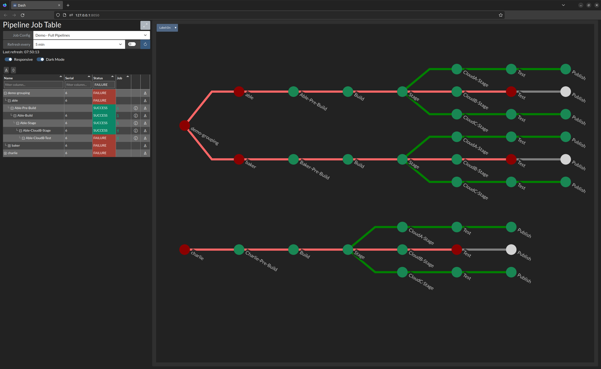
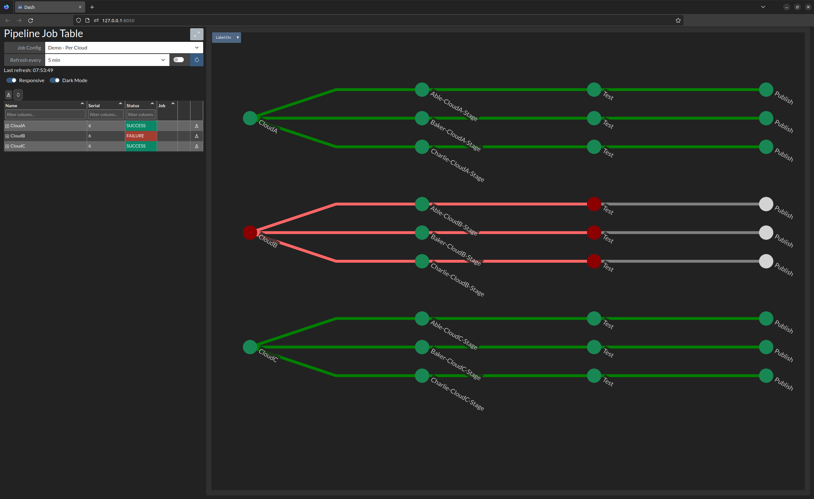

# Pipeline Dash Demo

This demo showcases Pipeline Dash against a small toy Jenkins setup with a few pipelines.

## Running the Demo

All necessary job data is stored for offline usage in `demo/offline-cache`, which allows Pipeline Dash to create a
dashboard without needing access to Jenkins instance or the internet at all.  Of course, this is cached data, so it 
will always be the same.

Clone and install pipeline-dash into a virtual environment:
```bash
git clone https://github.com/hammerstefan/pipeline-dash.git
cd pipeline-dash
poetry install
```

Run pipeline-dash:
```bash
cd demo
poetry run pd dash --recurse --load offline-cache pipeline_full.yaml pipeline_per_cloud.yaml
```

This will launch the server
```text
Dash is running on http://127.0.0.1:8050/
```

Open a browser at that URL to see the demo dashboards.

There are two views. First, the "Full Pipeline" view:

This shows all the pipelines, with `able` and `baker` pipelines collected into an optional grouping.

The second is the "Per Cloud" view:

This shows just the cloud-specific sections of the pipeline grouped by their cloud. This kind of view would be useful
for teams that are just needing to monitor a part of a pipeline for status in one or more clouds.

> **NOTE:** To switch views, select a different config in the dropdown on the left, and then click the "Refresh Now"
 button.

See the next section, [Demo Details](#demo-details), for a breakdown of the components of this demo.

## Demo Details

### CLI Command
The CLI command used to launch this demo is
```bash
poetry run pd dash --recurse --load offline-cache pipeline_full.yaml pipeline_per_cloud.yaml
```
Which is made up of the following pieces:
* `poetry run` - run the following command in the virtual environment created by `poetry install`
* `pd` - this is a CLI entrypoint (i.e. script) configured in `pyproject.toml`, resolves internally to the 
`pipeline_dash:main.cli` module
* `dash` - the pipeline-dash command to execute; `dash` is the command to create the web dashboard seen in the
screenshots above
* `--recurse` - enable the optional recursive mode, where any job in the `PIPELINE_CONFIG` marked with `$recurse: true`
will get info for all downstream jobs as well, and add them to the dashboard
* `--load offline-cache` - load the offline job data cache files located at `demo/offline-cache` to allow pipeline-dash
to generate the dashboard offline, without access to the Jenkins instance (useful for demo, developing the tool,
and integration testing)
* `pipeline_full.yaml pipeline_per_cloud.yaml` - the two `PIPELINE_CONFIG` files to load which will be available as
views on the dashboard

### Pipeline Configs

This demo has two pipeline configs two showcase two ways of inspecting pipelines.

#### `pipeline_full.yaml`
Top level view of all the pipelines. Intended to answer the question "what is the health of each CODENAME (e.g. Able)".
```yaml
name: Demo - Full Pipelines
servers:
  "http://localhost:8080":
    pipelines:
      .demo-grouping:
        .able:
          Able-Pre-Build:
            $recurse: true
        .baker:
          Baker-Pre-Build:
            $recurse: true
      .charlie:
        Charlie-Pre-Build:
          $recurse: true
```
Here we use `$recurse: true` to get downstream jobs for all jobs starting at the `{codename}-Pre-Build` jobs.  Each
mapping key that starts with a period (`.`) is a pipeline grouping that groups all downstream jobs together. This is
a useful tool to combine related pipelines together for status collection.

Recursing all jobs for all projects is a good way to get a complete overview of all your pipelines, however in complex
scenarios it can quickly become hard to inspect and monitor.  It is frequently useful to create a `PIPELINE_CONFIG` 
that is specific to what you really need to monitor, and structured in a way that answers the questions you want to ask
of it.

#### `pipeline_per_cloud.ymal`
A pared down view that organizes the pipelines by Cloud.  Intended to answer the question "what is the health of each
CLOUD (e.g. CloudA)"
```yaml
name: Demo - Per Cloud
servers:
  "http://localhost:8080":
    pipelines:
      .CloudA:
        Able-CloudA-Stage:
          $recurse: true
        Baker-CloudA-Stage:
          $recurse: true
        Charlie-CloudA-Stage:
          $recurse: true
      .CloudB:
        Able-CloudB-Stage:
          $recurse: true
        Baker-CloudB-Stage:
          $recurse: true
        Charlie-CloudB-Stage:
          $recurse: true
      .CloudC:
        Able-CloudC-Stage:
          $recurse: true
        Baker-CloudC-Stage:
          $recurse: true
        Charlie-CloudC-Stage:
          $recurse: true
```
Here we group the start of each CODENAME cloud specific pipelines into groupings named after their cloud.  For example,
we put Able-CloudA-Stage, Baker-CloudA-Stage, and Charlie-CloudA-Stage into a grouping called "CloudA" (it's a grouping
since it starts with a `.`), then we set `$recurse: true` to gather all downstream jobs.

### Jenkins Jobs
The Jenkins jobs are generated using [Jenkins Job Builder](https://jenkins-job-builder.readthedocs.io/en/latest/). You
can view the JJB config at `demo/jjb`.


### Reproducing as live system
If you want to reproduce the Jenkins pipelines, you will need a running Jenkins instance, and then run
```bash
jenkins-jobs --conf current.conf update jjb/ 
```
Where `current.conf` contains your server and credentials information
```ini
[job_builder]
ignore_cache=True

[jenkins]
url=http://localhost:8080/
user=admin
password=<admin-token>
```

If your Jenkins server is on a different url, make sure to update it in `current.conf` and in the `PIPELINE_CONFIG`
YAML files (which are configured to use servers `http://localhost:8080`).

Log in to the Jenkins instance and run the `00-Trigger-AlL` job which will trigger all the Jobs in the demo pipeline. 
This should complete in just a few seconds.

Create a `user.yaml` file containing your user/token for Jenkins
```yaml
user: admin
token: <admin-token>
```

Then to run pipeline-dash against the live Jenkins
```bash
poetry run pd dash --recurse --user-file user.yaml --store my-offline-cache pipeline_full.yaml pipeline_per_cloud.yaml
```
